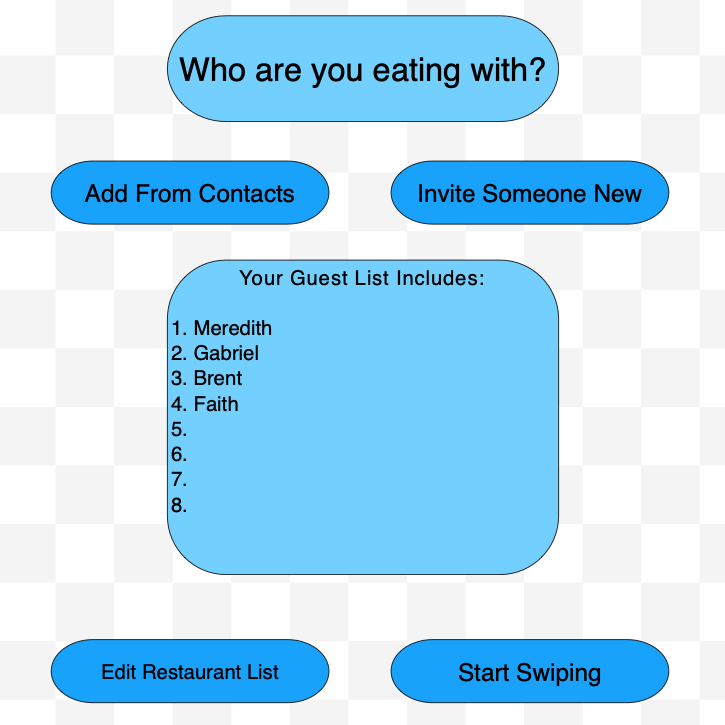
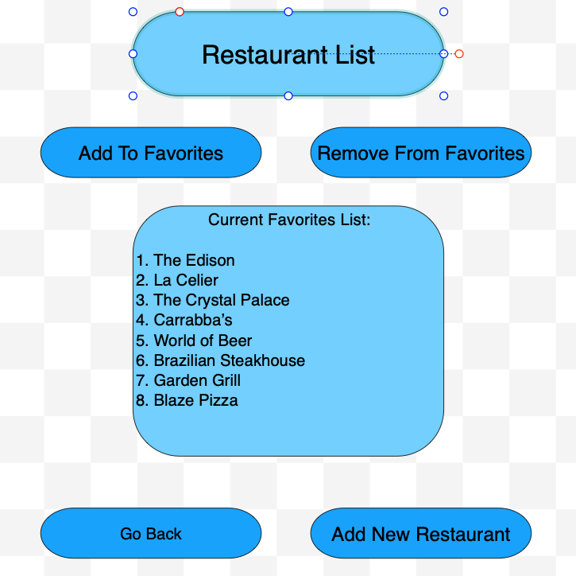
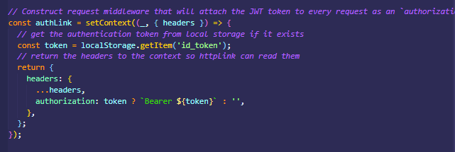

# Hungr

  

  ## Description
------
  Have you ever had the problem of trying to pick the right restaurant with your significant other or friends? Look no further, Hungr allows you to choose your favorite restaurants and send them to friends. With hungr you will never have trouble deciding where to eat again. 
   
 
  <em>
  Hungr is a Fullstack MERN application designed to hep users find restaurants to visit with a friend.</em>
  

### Deployed Page

  [Hungr Deployed Application](https://github.com/gabrielcalk/hungr)

 

  ## Table of Contents
  -------------
  * [Goals](#goals)
  * [Usage](#usage) 
  * [Installation](#installation)  
  * [Problems](#problems)
  * [Visualization](#visualization)
  * [Technologies](#technologies)
  * [Acknowledgements](#acknowledgements)
  * [Contributions](#contributions)
  * [Resources](#resources)
  * [License](#license) 
  * [Contact](#contact) 
  
   

  ## Goals
------
Use React for the front end.

* Use GraphQL with a Node.js and Express.js server.

* Use MongoDB and the Mongoose ODM for the database.

* Use queries and mutations for retrieving, adding, updating, and deleting data.

* Be deployed using Heroku (with data).

* Have a polished UI.

* Be responsive.

* Be interactive (i.e., accept and respond to user input).

* Include authentication (JWT).

* Protect sensitive API key information on the server.

* Have a clean repository that meets quality coding standards (file structure, naming conventions, best practices for class and id naming conventions, indentation, high-quality comments, etc.).

 

  ## Usage
-----
  Restaurant selector and food planning application.

  Application allows users to:
  * User will have the ability to create an account with a username, password and email address.
  * Search for restaurants based on their personal preferences.
  * Allow user to search for a restaurant based on their choices and invite a date to join them.
  * Users will have the ability to add friends, allow them to invite friends out to eat!
  * User will have the ability to favorite restaurants they have picked and pass those selections on to their friend to choose from a list of selected restaurants.
  * User will be able to invite a friend via email.
  * User will be Will be able to view all matched suggestions.
  * User will be notified when a match has taken place.

 

  ## Installation
  
 *  `npm install`

 

  ## Problems

  * CSS styling interacting with MUI caused great difficulties when interacting with components.
  * Accessing Google API - specifically with pulling the images
  * CORS Validation for API calls to Google Places
  * Ability to pass selected favorite restaurants called by the API onto the friend and match the results.
 

  ## Visualization

  
  
  
  
  
  
  
  

   ### Images of JWT
  

  
  ### Images of Deployed Application
  

 

  ## Technologies
  ----------
  * MongoDB & Mongoose for the database
  * React to design the front end
  * GraphQL with node.js and Express.js for the server.
  * Google Places API
  * Bootstrap-React for CSS
  * JWT For Authentication
  * Google Places API
  * NPM CORS

 

  ## Acknowledgements
--------------
  Staff and Faculty UCF Bootcamp. Specifically Dan Rosebaum

 

  ## Contributions
-------------
  Fork Request

 

  ## Resources
 ------------------
  Eloquent Javascript, React and React Native 3rd Edition, Stack Overflow, React Documentation, Bootstrap for React

 

  ## License
-----------------
  Copyright 2021 Gabriel Cavalcante Causin, Faith Green, Fenix Sampson, Meredith Coyne, Brent Graves

  Permission is hereby granted, free of charge, to any person obtaining a copy of this software and associated documentation files (the "Software"), to deal in the Software without restriction, including without limitation the rights to use, copy, modify, merge, publish, distribute, sublicense, and/or sell copies of the Software, and to permit persons to whom the Software is furnished to do so, subject to the following conditions:
  
  The above copyright notice and this permission notice shall be included in all copies or substantial portions of the Software.
  
  THE SOFTWARE IS PROVIDED "AS IS", WITHOUT WARRANTY OF ANY KIND, EXPRESS OR IMPLIED, INCLUDING BUT NOT LIMITED TO THE WARRANTIES OF MERCHANTABILITY, FITNESS FOR A PARTICULAR PURPOSE AND NONINFRINGEMENT. IN NO EVENT SHALL THE AUTHORS OR COPYRIGHT HOLDERS BE LIABLE FOR ANY CLAIM, DAMAGES OR OTHER LIABILITY, WHETHER IN AN ACTION OF CONTRACT, TORT OR OTHERWISE, ARISING FROM, OUT OF OR IN CONNECTION WITH THE SOFTWARE OR THE USE OR OTHER DEALINGS IN THE SOFTWARE.

 

  ## Contact
  ----------------
  Brent Ryan Graves GitHub Username: grave019  
 
  Link to Github Account [Brent Ryan Graves Github](https://github.com/grave019)

  Email: brent.r.graves82@gmail.com

   

  Gabriel Cavalcante Causin Github Username: gabrielcalk

  Link to Github Account [Gabriel Cavalcante Causin Github](https://github.com/gabrielcalk)

  email: gabrielcalk@outlook.com

   

  Fenix Sampson Github Username: FenixS83

  Link to Github Account [Fenix Sampson Github](https://github.com/FenixS83)

  Email: fenix.sampson@gmail.com

   

  Meredith Coyne Github Username: meredithcoyne

  Link to Github Account [Meredith Coyne Github](https://github.com/meredithcoyne)

  Email: meredithleigh.coyne@gmail.com

   

  Faith Green Github Username: faithelizagreen

  Link to Github Account [Faith Green](https://github.com/faithelizagreen)

  Email: faithgreen@knights.ucf.edu