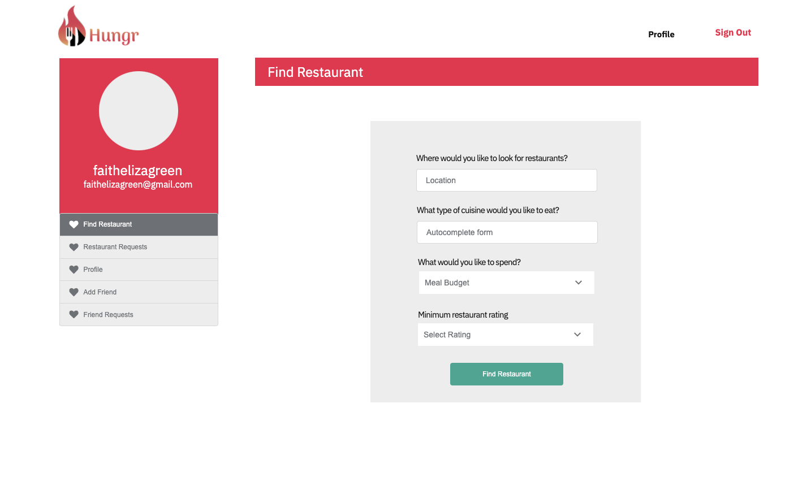

# Hungr

  

  ## Description

  Have you ever had the problem of trying to pick the right restaurant with your significant other or friends? Look no further, Hungr allows you to choose your favorite restaurants and send them to friends. With hungr you will never have trouble deciding where to eat again.
  
  Click the link below to visit my deployed page.

  [Hungr Deployed Page Change Link to ](https://github.com/gabrielcalk/hungr)

  ## Table of Contents
  
  * [Goals](#goals)
  * [Usage](#usage) 
  * [Installation](#installation)  
  * [Test](#test)
  * [Problems](#problems)
  * [Visualization](#visualization)
  * [Acknowledgements](#acknowledgements)
  * [Contributions](#contributions)
  * [Resources](#resources)
  * [License](#license) 
  * [Contact](#contact) 
  
  ## Goals

  ## Usage

  Restaurant selector and food planning application.

  Application allows users to:
  * User will have the ability to create an account to start all functionality.
  * Search for restaurants based on their personal preferences.
  * Allow user to search just for self or to provide search results with a friend.
  * Users will have the ability to add friends, allow them to invite friends out to eat!
  * User will have the ability to favorite restaurants they enjoyed.

  ## Installation
  
  `npm start`

  ## Test

  no test are needed to 

  ## Problems

  CSS styling interacting with MUI caused great difficulties when interacting with components.

  ## Visualization

  Mockups
  
  
  
  
  
Images of Deployed Application

  ## Acknowledgements

  Gabriel Cavalcante Causin, Faith Green, Fenix Sampson, Meredith Coyne, Brent Graves

  ## Contributions

  Fork Request

  ## Resources
 
  Eloquent Javascript, React and React Native 3rd Edition, Stack Overflow, React Documentation

  ## License

  Copyright 2021 Gabriel Cavalcante Causin, Faith Green, Fenix Sampson, Meredith Coyne, Brent Graves

  Permission is hereby granted, free of charge, to any person obtaining a copy of this software and associated documentation files (the "Software"), to deal in the Software without restriction, including without limitation the rights to use, copy, modify, merge, publish, distribute, sublicense, and/or sell copies of the Software, and to permit persons to whom the Software is furnished to do so, subject to the following conditions:
  
  The above copyright notice and this permission notice shall be included in all copies or substantial portions of the Software.
  
  THE SOFTWARE IS PROVIDED "AS IS", WITHOUT WARRANTY OF ANY KIND, EXPRESS OR IMPLIED, INCLUDING BUT NOT LIMITED TO THE WARRANTIES OF MERCHANTABILITY, FITNESS FOR A PARTICULAR PURPOSE AND NONINFRINGEMENT. IN NO EVENT SHALL THE AUTHORS OR COPYRIGHT HOLDERS BE LIABLE FOR ANY CLAIM, DAMAGES OR OTHER LIABILITY, WHETHER IN AN ACTION OF CONTRACT, TORT OR OTHERWISE, ARISING FROM, OUT OF OR IN CONNECTION WITH THE SOFTWARE OR THE USE OR OTHER DEALINGS IN THE SOFTWARE.

  ## Contact
  
  Brent Ryan Graves GitHub Username: grave019  
 
  Link to Github Account [Brent Ryan Graves Github](https://github.com/grave019)

  Email: brent.r.graves82@gmail.com

  Gabriel Cavalcante Causin Github Username: gabrielcalk

  Link to Github Account [Gabriel Cavalcante Causin Github](https://github.com/gabrielcalk)

  email: gabrielcalk@outlook.com

  Fenix Sampson Github Username: FenixS83

  Link to Github Account [Fenix Sampson Github](https://github.com/FenixS83)

Email: fenix.sampson@gmail.com

Meredith Coyne Github Username: meredithcoyne

Link to Github Account [Meredith Coyne Github](https://github.com/meredithcoyne)

Email: meredithleigh.coyne@gmail.com

Faith Green Github Username: faithelizagreen

Link to Github Account [Faith Green](https://github.com/faithelizagreen)

Email: faithgreen@knights.ucf.edu